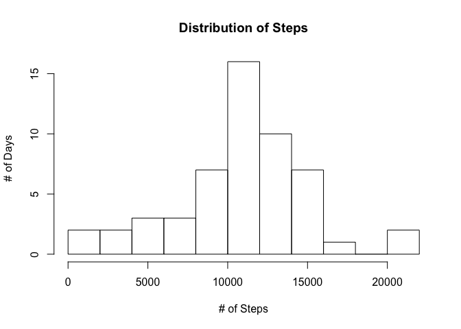
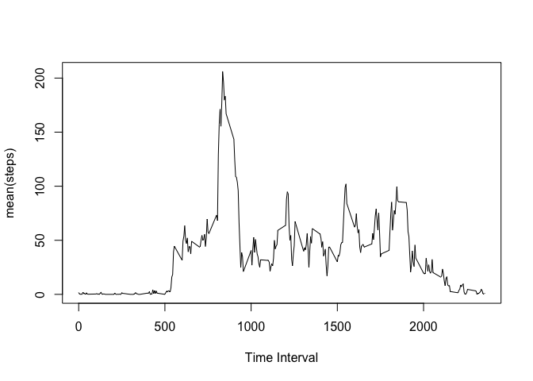
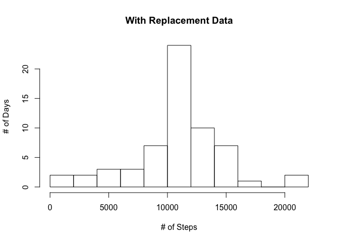
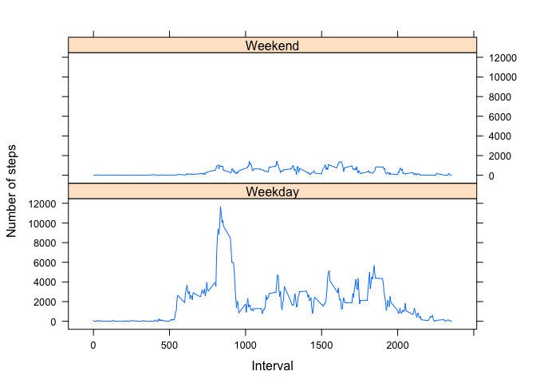

# Reproducible Research: Peer Assessment 1


## Loading and preprocessing the data
Load the data using read.csv() which will load the 'NA' values for the steps columns.  Show the summary of the obersavations.

```r
setwd('~/Documents/repos/rr-1')
act_tbl <- read.csv("activity.csv")
summary(act_tbl)
```

```
##      steps                date          interval     
##  Min.   :  0.00   2012-10-01:  288   Min.   :   0.0  
##  1st Qu.:  0.00   2012-10-02:  288   1st Qu.: 588.8  
##  Median :  0.00   2012-10-03:  288   Median :1177.5  
##  Mean   : 37.38   2012-10-04:  288   Mean   :1177.5  
##  3rd Qu.: 12.00   2012-10-05:  288   3rd Qu.:1766.2  
##  Max.   :806.00   2012-10-06:  288   Max.   :2355.0  
##  NA's   :2304     (Other)   :15840
```


## What is mean total number of steps taken per day?
Use the *aggregate* function to sum up the steps by day.

```r
steps_per_day <- aggregate (steps ~ date, act_tbl, sum)
head(steps_per_day)
```

```
##         date steps
## 1 2012-10-02   126
## 2 2012-10-03 11352
## 3 2012-10-04 12116
## 4 2012-10-05 13294
## 5 2012-10-06 15420
## 6 2012-10-07 11015
```

```r
summary(steps_per_day)
```

```
##          date        steps      
##  2012-10-02: 1   Min.   :   41  
##  2012-10-03: 1   1st Qu.: 8841  
##  2012-10-04: 1   Median :10765  
##  2012-10-05: 1   Mean   :10766  
##  2012-10-06: 1   3rd Qu.:13294  
##  2012-10-07: 1   Max.   :21194  
##  (Other)   :47
```

#### Histogram (# of Days by Total Step bins)

```r
hist(steps_per_day$steps,breaks=9, ylab="# of Days", xlab="# of Steps", main="Distribution of Steps")
```

 

#### Mean Steps Per Day, and  Median Steps
Calculate the *mean* and *median* using the proper function.  Also, skip NA values.

```r
mean(steps_per_day$steps, na.rm = TRUE)
```

```
## [1] 10766.19
```

```r
median(steps_per_day$steps, na.rm = TRUE)
```

```
## [1] 10765
```
Notice that the mean() and median() steps per day did not change dramatically.  This is makes sense because we replaced NA values with the mean(steps) for that particular interval.  However, the histogram did become more centered around the mean with more days exceeding 10K steps per day.

## What is the average daily activity pattern?
1. Use the *aggregate* function to get the *mean* by time interval.  
2. Store that in a data frame.
3. Plot the line chart (time series)


```r
avg_intv <- aggregate (steps ~ interval, act_tbl, mean, na.rm = TRUE)
plot(avg_intv$interval,avg_intv$steps, type='l',xlab="Time Interval", ylab="mean(steps)")
```

 

### Time Interval with the highest average stepshea

```r
avg_intv[which (avg_intv$steps == max(avg_intv$steps)),]
```

```
##     interval    steps
## 104      835 206.1698
```
### 
## Imputing missing values

### Calculate the missing values

```r
length( act_tbl [which (is.na(act_tbl$steps)), 1])
```

```
## [1] 2304
```
### Replace missing values
Use the mean(steps) for the interval across all days

```r
repl_act <- act_tbl
for (i in 1:nrow(repl_act))
{
  if (is.na (repl_act[i,1]) )
       repl_act[i,1] <- mean(repl_act[ 
           which (repl_act$interval == repl_act[i,3])  ,1], na.rm=TRUE)
}
head(repl_act)
```

```
##       steps       date interval
## 1 1.7169811 2012-10-01        0
## 2 0.3396226 2012-10-01        5
## 3 0.1320755 2012-10-01       10
## 4 0.1509434 2012-10-01       15
## 5 0.0754717 2012-10-01       20
## 6 2.0943396 2012-10-01       25
```

### Histogram of the data with replacement data

```r
steps_per_day <- aggregate (steps ~ date, repl_act, sum)
summary(steps_per_day)
```

```
##          date        steps      
##  2012-10-01: 1   Min.   :   41  
##  2012-10-02: 1   1st Qu.: 9819  
##  2012-10-03: 1   Median :10766  
##  2012-10-04: 1   Mean   :10766  
##  2012-10-05: 1   3rd Qu.:12811  
##  2012-10-06: 1   Max.   :21194  
##  (Other)   :55
```

```r
hist(steps_per_day$steps,breaks=9, ylab="# of Days", xlab="# of Steps", main="With Replacement Data")
```

 

## Are there differences in activity patterns between weekdays and weekends?

```r
isWeekday <- function (d)
{
  wd <- weekdays(as.Date( as.character(d) ), abbreviate=TRUE  )

  r <- factor()
  if (wd == "Sun" || d == "Sat")
    r <- as.factor("Weekend")
  else
    r <- as.factor("Weekday")
  is
  r
  
}

repl_act$daytype <- factor( c("Weekday", "Weekend") )
for (i in 1:nrow(repl_act))
{
  repl_act[i,4] <- isWeekday(repl_act[i,2])
}
wks <- aggregate (steps ~ interval+daytype, repl_act, sum, na.rm = TRUE)

attach(wks)
library(lattice)
xyplot(steps ~ interval| daytype, 
           data = wks,
           type = "l",
           xlab = "Interval",
           ylab = "Number of steps",
           layout=c(1,2))
```

 
