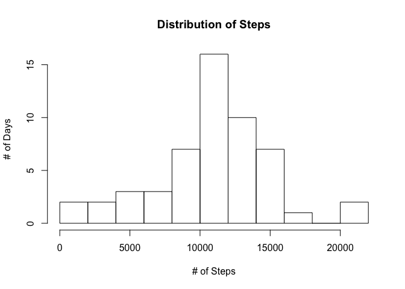
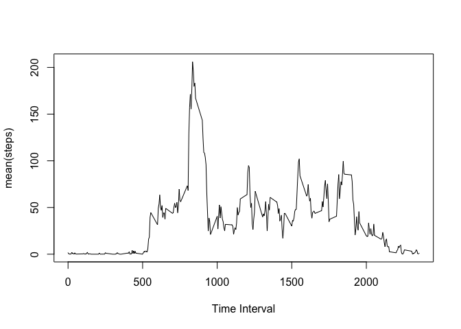

# Reproducible Research: Peer Assessment 1


## Loading and preprocessing the data
Load the data using read.csv() which will load the 'NA' values for the steps columns.  Show the summary of the obersavations.

```r
setwd('~/Documents/repos/reproducible_resarch/RepData_PeerAssessment1')
act_tbl <- read.csv("activity.csv")
summary(act_tbl)
```

```
##      steps                date          interval     
##  Min.   :  0.00   2012-10-01:  288   Min.   :   0.0  
##  1st Qu.:  0.00   2012-10-02:  288   1st Qu.: 588.8  
##  Median :  0.00   2012-10-03:  288   Median :1177.5  
##  Mean   : 37.38   2012-10-04:  288   Mean   :1177.5  
##  3rd Qu.: 12.00   2012-10-05:  288   3rd Qu.:1766.2  
##  Max.   :806.00   2012-10-06:  288   Max.   :2355.0  
##  NA's   :2304     (Other)   :15840
```


## What is mean total number of steps taken per day?
Use the *aggregate* function to sum up the steps by day.

```r
steps_per_day <- aggregate (steps ~ date, act_tbl, sum)
head(steps_per_day)
```

```
##         date steps
## 1 2012-10-02   126
## 2 2012-10-03 11352
## 3 2012-10-04 12116
## 4 2012-10-05 13294
## 5 2012-10-06 15420
## 6 2012-10-07 11015
```

#### Histogram (# of Days by Total Step bins)

```r
hist(steps_per_day$steps,breaks=9, ylab="# of Days", xlab="# of Steps", main="Distribution of Steps")
```

 

#### Mean Steps Per Day, and  Median Steps
Calculate the *mean* and *median* using the proper function.  Also, skip NA values.

```r
mean(steps_per_day$steps, na.rm = TRUE)
```

```
## [1] 10766.19
```

```r
median(steps_per_day$steps, na.rm = TRUE)
```

```
## [1] 10765
```


## What is the average daily activity pattern?
1. Use the *aggregate* function to get the *mean* by time interval.  
2. Store that in a data frame.
3. Plot the line chart (time series)


```r
avg_intv <- aggregate (steps ~ interval, act_tbl, mean, na.rm = TRUE)
plot(avg_intv$interval,avg_intv$steps, type='l',xlab="Time Interval", ylab="mean(steps)")
```

 

### Time Interval with the highest average stepshea

```r
avg_intv[which (avg_intv$steps == max(avg_intv$steps)),]
```

```
##     interval    steps
## 104      835 206.1698
```
### 
## Imputing missing values


## Are there differences in activity patterns between weekdays and weekends?
